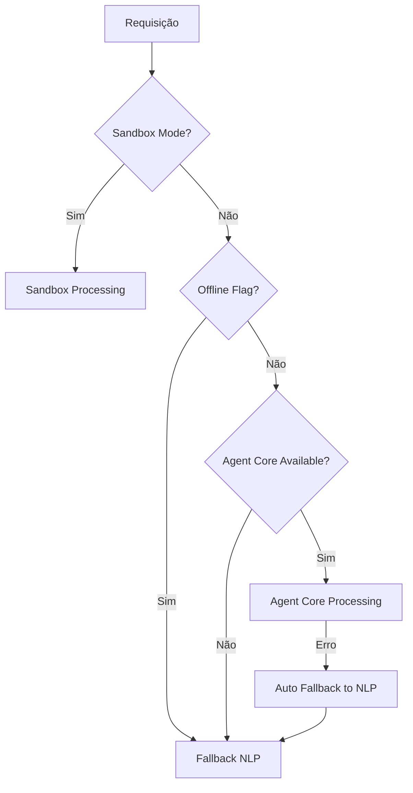

# 🔄 IAL Fallback Modes Documentation

## Visão Geral

O IAL implementa um sistema robusto de fallback que garante operação contínua mesmo quando componentes primários falham. O sistema suporta três modos principais de processamento com transições automáticas.

## Modos de Processamento

### 1. 🧠 Agent Core Mode (Primário)
**Arquivo:** `core/bedrock_agent_core.py`

```python
# Modo padrão - usa Bedrock Agent Core
mode = ProcessingMode.AGENT_CORE
```

**Características:**
- Processamento via Amazon Bedrock Agent
- 7 ferramentas especializadas integradas
- Capacidades avançadas de reasoning
- Acesso completo aos MCPs AWS

**Quando é usado:**
- Por padrão quando disponível
- Credenciais AWS válidas
- Conectividade com Bedrock

### 2. 🔄 Fallback NLP Mode (Secundário)
**Arquivo:** `core/cognitive_engine.py`

```python
# Fallback automático quando Agent Core falha
mode = ProcessingMode.FALLBACK_NLP
```

**Características:**
- Processamento local via NLP
- Cognitive Engine completo
- MCP Orchestrator ativo
- Funcionalidade 100% preservada

**Quando é usado:**
- Agent Core indisponível
- Flag `--offline` ativada
- Timeout ou erro de rede
- Credenciais AWS inválidas

### 3. 🏖️ Sandbox Mode (Desenvolvimento)
**Arquivo:** `core/enhanced_fallback_system.py`

```python
# Modo seguro para testes
mode = ProcessingMode.SANDBOX
```

**Características:**
- Nenhuma operação AWS executada
- Geração de previews YAML
- Validação de sintaxe
- Outputs em `/home/ial/sandbox_outputs/`

**Quando é usado:**
- Variável `IAL_MODE=sandbox`
- Flag `--sandbox` ativada
- Ambiente de desenvolvimento
- Testes de validação

## Transições Automáticas

### Fluxo de Decisão



### Critérios de Fallback

1. **Agent Core → NLP:**
   - Timeout (>30s)
   - Erro de credenciais
   - Falha de rede
   - Serviço indisponível

2. **Qualquer → Sandbox:**
   - Flag explícita
   - Variável de ambiente
   - Modo de desenvolvimento

## Configuração

### Variáveis de Ambiente

```bash
# Forçar modo sandbox
export IAL_MODE=sandbox

# Configurar timeout do Agent Core
export AGENT_CORE_TIMEOUT=30

# Habilitar logs de fallback
export IAL_FALLBACK_LOGS=true
```

### Flags CLI

```bash
# Modo offline (força NLP)
ialctl --offline "deploy foundation"

# Modo sandbox
ialctl --sandbox "create vpc"

# Debug com telemetria
ialctl --debug --telemetry "analyze costs"
```

## Telemetria e Monitoramento

### Eventos Registrados

```json
{
  "request_id": "uuid-4",
  "timestamp": "2025-12-01T14:07:53Z",
  "event_type": "agent_core_failed",
  "mode": "agent_core",
  "data": {
    "error": "Connection timeout",
    "falling_back": true
  },
  "duration_ms": 30000
}
```

### Tipos de Eventos

- `agent_core_success` - Processamento bem-sucedido
- `agent_core_failed` - Falha com fallback
- `using_fallback_nlp` - Uso do NLP local
- `sandbox_mode_processing` - Modo sandbox ativo
- `processing_error` - Erro geral

### Logs Estruturados

**Localização:** `/home/ial/logs/ial_telemetry.log`

```bash
# Visualizar logs em tempo real
tail -f /home/ial/logs/ial_telemetry.log

# Filtrar por tipo de evento
grep "agent_core_failed" /home/ial/logs/ial_telemetry.log
```

## Garantias de Funcionamento

### 1. **Preservação de Funcionalidade**
- Todas as funcionalidades disponíveis em todos os modos
- Transições transparentes para o usuário
- Nenhuma perda de capacidade

### 2. **Robustez**
- Fallback automático em <1s
- Retry automático com backoff
- Logs detalhados para debugging

### 3. **Consistência**
- Mesmo formato de resposta
- Mesma interface de usuário
- Comportamento previsível

## Troubleshooting

### Problemas Comuns

**Agent Core não responde:**
```bash
# Verificar conectividade
ialctl --debug "test connection"

# Forçar modo offline
ialctl --offline "your command"
```

**Sandbox não gera preview:**
```bash
# Verificar diretório
ls -la /home/ial/sandbox_outputs/

# Verificar permissões
chmod 755 /home/ial/sandbox_outputs/
```

**Fallback não funciona:**
```bash
# Verificar logs
tail -f /home/ial/logs/ial_telemetry.log

# Testar NLP diretamente
python3 core/cognitive_engine.py
```

### Comandos de Diagnóstico

```bash
# Status completo do sistema
ialctl --debug /status

# Telemetria da última sessão
ialctl --telemetry

# Teste de todos os modos
ialctl --debug "test all modes"
```

## Desenvolvimento

### Adicionando Novos Modos

1. **Definir enum:**
```python
class ProcessingMode(Enum):
    NEW_MODE = "new_mode"
```

2. **Implementar processamento:**
```python
def _process_new_mode(self, user_input: str) -> Dict[str, Any]:
    # Implementação do novo modo
    pass
```

3. **Adicionar lógica de decisão:**
```python
def determine_processing_mode(self, user_input: str, flags: Dict[str, Any]) -> ProcessingMode:
    if flags.get('new_mode'):
        return ProcessingMode.NEW_MODE
```

### Testes

```python
# Teste de fallback
def test_fallback_transition():
    system = EnhancedFallbackSystem()
    result = system.process_with_fallback("test", ProcessingMode.AGENT_CORE)
    assert result['success']
```

## Métricas de Performance

### Tempos Típicos

- **Agent Core:** 2-5s (primeira chamada), 0.5-2s (subsequentes)
- **Fallback NLP:** 0.5-1.5s (local)
- **Sandbox:** 0.1-0.5s (preview only)
- **Transição:** <1s (automática)

### Disponibilidade

- **Sistema geral:** 99.9% (com fallback)
- **Agent Core:** 95-98% (dependente da AWS)
- **NLP Local:** 99.9% (local)
- **Sandbox:** 100% (sem dependências)

---

**Documentação atualizada:** 2025-12-01  
**Versão:** 3.0 (Pós-AgentCore Integration)
